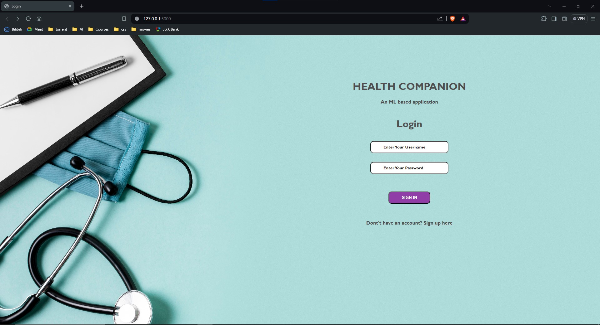
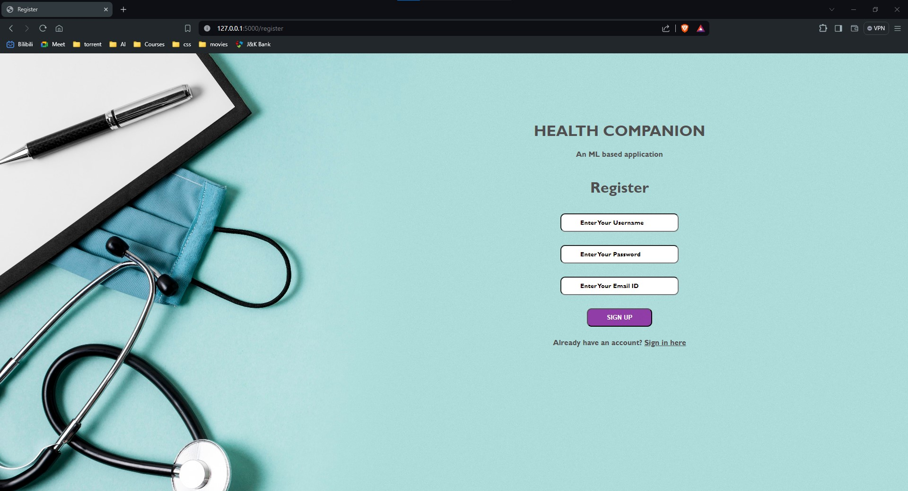
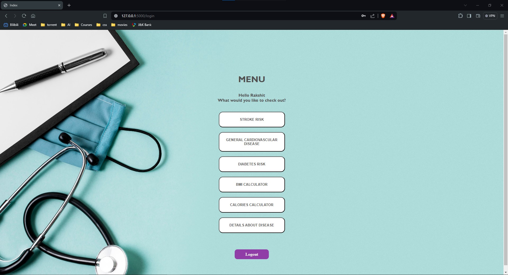
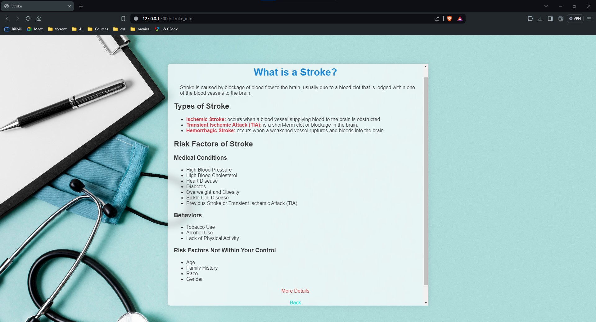
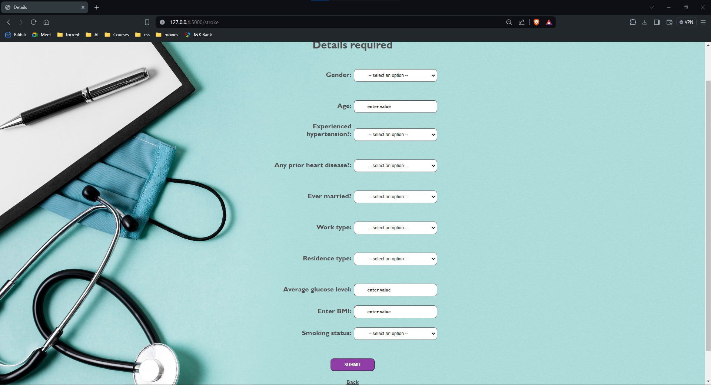
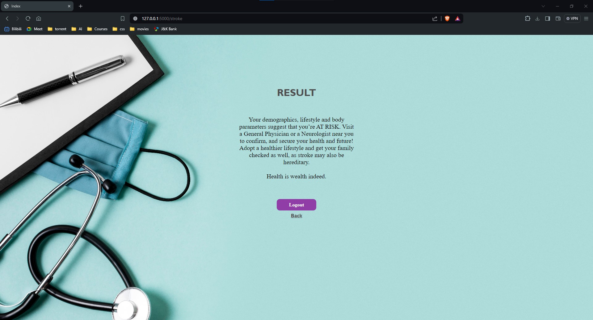

# Health Companion

Welcome to the Health Companion repository! This project aims to provide a comprehensive health monitoring and prediction tool using machine learning. The application can predict the risk of various diseases such as stroke, cardiovascular diseases, and diabetes. It also includes a BMI calculator and a calorie calculator.

GitHub Repository: [Health Companion](https://github.com/Rakshitgupta9/Health-Companion)

## Table of Contents

1. [Introduction](#introduction)
2. [Features](#features)
3. [Technologies Used](#technologies-used)
4. [Installation](#installation)
5. [Usage](#usage)
6. [Database Schema](#database-schema)
7. [Screenshots](#screenshots)
8. [Future Enhancements](#future-enhancements)
9. [Contributing](#contributing)
10. [License](#license)

## Introduction

Health Companion is a web application designed to help users monitor and predict their risk for certain health conditions using machine learning algorithms. The application is user-friendly and provides detailed information and insights based on user input.

## Features

- **Disease Prediction**: Predicts the risk of stroke, cardiovascular diseases, and diabetes.
- **BMI Calculator**: Calculates Body Mass Index (BMI) based on height and weight.
- **Calorie Calculator**: Estimates daily calorie needs based on various factors.
- **User Authentication**: Secure login and registration for personalized experience.

## Technologies Used

- **Frontend**: HTML, CSS, JavaScript
- **Backend**: Python (Flask)
- **Database**: MySQL
- **Machine Learning**: Various ML models for disease prediction

## Installation

1. Clone the repository:
    ```sh
    git clone https://github.com/Rakshitgupta9/Health-Companion.git
    ```
2. Navigate to the project directory:
    ```sh
    cd Health-Companion
    ```
3. Install the required packages:
    ```sh
    pip install -r requirements.txt
    ```
4. Set up the database:
    - Import the SQL files located in the `database` folder into your MySQL database.
    - Update the database connection details in the `app.py` file.

5. Run the application:
    ```sh
    python app.py
    ```

## Usage

1. **Login**: Access the application by logging in with your credentials. If you don't have an account, you can register a new one.

    

2. **Register**: Create a new account by providing the necessary information.

    

3. **Dashboard**: Once logged in, you can navigate to various features such as stroke risk prediction, cardiovascular disease prediction, diabetes risk prediction, BMI calculator, and calorie calculator.

    

4. **Disease Prediction**: Enter the required information to get a prediction for the risk of stroke, cardiovascular disease, or diabetes.

    

5. **Results**: View the prediction results along with additional insights and suggestions.

    

## Database Schema

### account_cardiovascular
| Column           | Type    | Description                |
|------------------|---------|----------------------------|
| id               | INT     | Primary Key                |
| age1             | INT     | Age                        |
| gender1          | INT     | Gender                     |
| height           | FLOAT   | Height                     |
| weight           | FLOAT   | Weight                     |
| ap_hi            | INT     | Systolic Blood Pressure    |
| ap_lo            | INT     | Diastolic Blood Pressure   |
| cholesterol      | INT     | Cholesterol Level          |
| glu              | INT     | Glucose Level              |
| smoke            | INT     | Smoking Status             |
| alco             | INT     | Alcohol Intake             |
| active           | INT     | Physical Activity          |
| CARDIO_DISEASE   | INT     | Cardiovascular Disease Risk|

### account_dia
| Column                | Type    | Description                |
|-----------------------|---------|----------------------------|
| id                    | INT     | Primary Key                |
| pregnancies           | INT     | Number of Pregnancies      |
| glucose               | INT     | Glucose Level              |
| bloodpressure         | INT     | Blood Pressure             |
| skinthickness         | INT     | Skin Thickness             |
| insulin               | INT     | Insulin Level              |
| bmi_dia               | FLOAT   | BMI                        |
| diabetes_pedigree_fnc | FLOAT   | Diabetes Pedigree Function |
| age_dia               | INT     | Age                        |
| outcome               | INT     | Diabetes Risk              |

### accounts
| Column      | Type        | Description      |
|-------------|-------------|------------------|
| id          | INT         | Primary Key      |
| username    | VARCHAR(50) | Username         |
| password    | VARCHAR(255)| Password         |
| email       | VARCHAR(100)| Email            |

### account_stroke
| Column           | Type    | Description                 |
|------------------|---------|-----------------------------|
| id               | INT     | Primary Key                 |
| gender           | INT     | Gender                      |
| age              | INT     | Age                         |
| hypertension     | INT     | Hypertension Status         |
| heart_disease    | INT     | Heart Disease Status        |
| ever_married     | INT     | Marital Status              |
| work_type        | INT     | Type of Work                |
| residence_type   | INT     | Type of Residence           |
| avg_glucose_level| FLOAT   | Average Glucose Level       |
| bmi              | FLOAT   | BMI                         |
| smoking_status   | INT     | Smoking Status              |
| stroke           | INT     | Stroke Risk                 |

## Screenshots

### Login Page


### Register Page


### Dashboard


### Disease Info Page


### Value Input


### Result Page



## Future Enhancements

- **Doctor Information**: Provide information about doctors near the user's location for specific diseases.
- **Remedies and Tips**: Offer remedies and health tips based on the user's health data.
- **More Disease Predictions**: Expand the application to predict risks for additional diseases.

## Contributing

Contributions are welcome! 

## License

This project is licensed under the MIT License. See the [LICENSE](LICENSE) file for details.

---

Thank you for visiting the Health Companion repository! If you have any questions or feedback, feel free to open an issue or contact us.

GitHub: [Rakshitgupta9](https://github.com/Rakshitgupta9)
